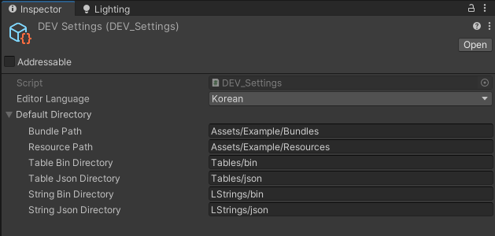
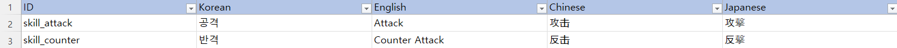
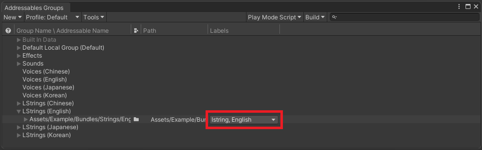

# Devarc (v1.0.0)
Devarc is cross-platform development templates.

#### Devarc supports ####
- Windows development evironment.
- PC, Mobile, WebGL client platforms.
- NodeJS, CSharp servers.
- MySQL database.

#### Devarc includes ####
- Protocol builder.
- Table builder.
- Unity: Asset Management.
- Unity: Simple sound manager.
- Unity: Simple effect manager.
- Unity: Simple animation manager.
- Unity: Simple data encryption.

#### Test Release ####
- [Android version](http://ec2-52-78-42-13.ap-northeast-2.compute.amazonaws.com/devarc.apk)
- [WebGL version](http://ec2-52-78-42-13.ap-northeast-2.compute.amazonaws.com/d/index.html)


## Install Client ##
#### Step 1: Create unity project. ####
#### Step 2: Download packages, and import into unity project. ####
  * https://github.com/devwinsoft/devarc/blob/main/install
  * https://github.com/MessagePack-CSharp/MessagePack-CSharp/releases
  * https://github.com/psygames/UnityWebSocket
    

## Install C# Server ##
#### Step 1: Create csharp project. ####
#### Step 2: Download projects, and import into C# project. ####
  * https://github.com/devwinsoft/devarc/tree/main/src/Devarc.Net.Common
  * https://github.com/devwinsoft/devarc/tree/main/src/Devarc.Net.Server
  * https://github.com/sta/websocket-sharp

## Install Node.JS Server ##
  * Now, working...
## Protocol Builder ##
#### Step 1: Create shared definitions with C#. ####
```csharp
public enum ErrorType
{
    SUCCESS          = 0,
    UNKNOWN          = 1,
    SERVER_ERROR     = 2,
    SESSION_EXPIRED  = 3,
}
```
#### Step 2: Create shared protocols with C#. ####
```csharp
// Protocol from:Client to:AuthServer
namespace C2Auth
{
    public class RequestLogin
    {
        public string accountID;
        public string password;
    }
}

// Protocol from:AuthServer to:Client
namespace Auth2C
{
    public class NotifyLogin
    {
        public ErrorType errorCode;
        public string sessionID;
        public int secret;
    }
}
```
#### Step 3: Create batch files. ####
```
IDL.exe -cs-def  {SchemaFolder}\Common.def
IDL.exe -js  {SchemaFolder}\AuthProtocol.idl  {SchemaFolder}\Common.def
TableBuilder.exe -cs {SchemaFolder}\SoundTable.xlsx
move /Y   *.cs    {UnityProjectFolder}\Assets\Scripts\Generated\
```

## Table Builder ##

#### Step 1: Create Excel Tables. ####

#### Step 2: Create batch files. ####
```
..\..\bin\TableBuilder.exe -cs .\Tables\GameTable.xlsx
move /Y   *.cs    ..\UnityClient\Assets\Example\Scripts\Generated\Tables\

..\..\bin\TableBuilder.exe -json .\Tables\GameTable.xlsx
move /Y   *.json    ..\UnityClient\Assets\Example\Bundles\Tables\

..\..\bin\TableBuilder.exe -sql .\Tables\GameTable.xlsx
move /Y   *.ddl    ..\Database\Tables\
move /Y   *.sql    ..\Database\Tables\
```

## Unity: Asset Management ##

#### Step 1: Configure DEV_Settings. ####


#### Step 2: Create common tables and localizing table. ####


#### Step 3: Edit addressable configuration. ####


#### Step 4: Initialize managers. ####
```csharp
void Awake()
{
    // Initialize TableManager.
    TableManager.Create();
    TableManager.Instance.OnError += (errorType, args) =>
    {
        // Error handling...
    };

    // Initialize DownloadManager.
    #if !UNITY_EDITOR
    DownloadManager.Instance.AddToPatchList("table-bin");
    DownloadManager.Instance.AddToPatchList("lstring-bin");
    #endif

    DownloadManager.Instance.AddToPatchList("effect");
    DownloadManager.Instance.AddToPatchList("sound");
    
    DownloadManager.Instance.OnPatch += (info) =>
    {
        DownloadManager.Instance.BeginDownload();
    };
    
    DownloadManager.Instance.OnResult += () =>
    {
        // Load bundles...
        StartCoroutine(loadAssets());
    };
    
    DownloadManager.Instance.OnError += () =>
    {
        // Error handling...
    };

    // Begin patch process.
    //DownloadManager.Instance.BeginPatch();
}
```

#### Step 5: Script loading assets. ####
```csharp
IEnumerator loadAssets()
{
    // Load resouce assets...
    TableManager.Instance.LoadResourceTable();
    TableManager.Instance.LoadResourceString(SystemLanguage.English);
    SoundManager.Instance.LoadResource();

    // Load bundle assets...
#if UNITY_EDITOR
    yield return TableManager.Instance.LoadBundleTable("table-json", TableFormatType.JSON);
    yield return TableManager.Instance.LoadBundleString("lstring-json", TableFormatType.JSON, SystemLanguage.English);
#else
    yield return TableManager.Instance.LoadBundleTable("table-bin", TableFormatType.BIN);
    yield return TableManager.Instance.LoadBundleString("lstring-bin", TableFormatType.BIN, SystemLanguage.English);
#endif
    yield return EffectManager.Instance.LoadBundle("effect");
    yield return SoundManager.Instance.LoadBundle("sound");
}
```
#### Step 6: Script unloading assets. ####
```csharp
void unloadAssets()
{
    // Unload resource assets...
    TableManager.Instance.UnloadResourceTable();
    TableManager.Instance.UnloadResourceString();
    SoundManager.Instance.UnloadResource();

    // Unload bundle assets...
#if UNITY_EDITOR
    TableManager.Instance.UnloadBundleTable("table-json");
    TableManager.Instance.UnloadBundleString("lstring-json");
#else
    TableManager.Instance.UnloadBundleTable("table-bin");
    TableManager.Instance.UnloadBundleString("lstring-bin");
#endif
    EffectManager.Instance.UnloadBundle("effect");
    SoundManager.Instance.UnloadBundle("sound");
}
```

## Unity: Simple Sound Manager. ##
  
## Unity: Simple Effect Manager. ##

## Unity: Simple Animation Manager. ##

## Unity: Data Encryption ##

## License ##

Devarc is provided under [Apache License 2.0].


